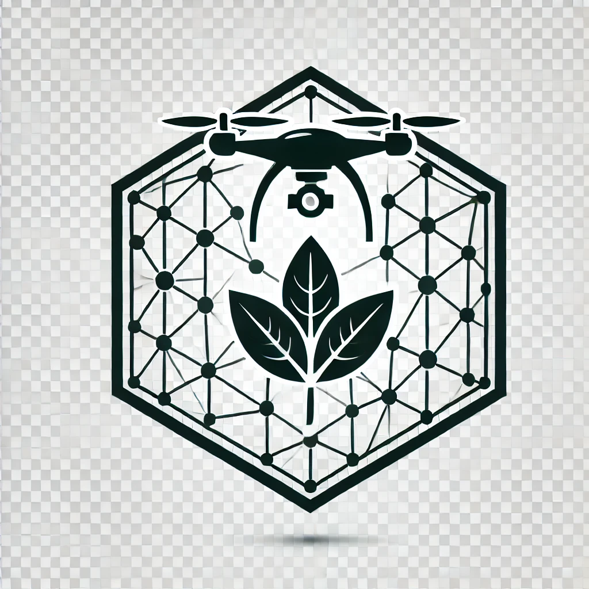

# 🌾 Projeto: AgriSeg U-Net 🌍


## 📝 Descrição do Projeto
AgriSeg U-Net é uma ferramenta baseada em Inteligência Artificial (IA) para segmentação de imagens agrícolas, com foco em identificar padrões de plantio, áreas de falha, resíduos de madeira e outras características relevantes.

## Principais Funcionalidades:

### 🌱 Segmentação Inteligente: Algoritmo U-Net para detecção de padrões e objetos em imagens agrícolas.

### 🚀 Pipeline Automatizado: Fluxo integrado para recorte de imagens, treinamento e predição.

### 💾 Compatibilidade: Suporte a formatos de imagem TIFF e JPG.

### 📊 Resultados Georreferenciados: Exportação de shapefiles para análise SIG.

## 🎯 Objetivo

## Proporcionar um sistema eficaz para:
### Análise automatizada de imagens agrícolas.
### Identificação de áreas críticas para manejo.
### Integração com sistemas de informações geográficas (SIG).

## 📂 Estrutura de Diretórios
### A estrutura do projeto segue o seguinte formato:

```
AgriSeg_UNet/
├── src/                        # Scripts principais
│   ├── preprocessing.py        # Pré-processamento de dados
│   ├── train.py                # Treinamento do modelo
│   ├── predict.py              # Predições e geração de shapefiles
│   ├── utils.py                # Funções auxiliares
├── data/                       # Dados utilizados no projeto
│   ├── raw/                    # Dados brutos
│   ├── processed/              # Dados processados
│   ├── train/                  # Dados de treinamento
│   ├── val/                    # Dados de validação
│   ├── predict/                # Dados para predição
│   │   ├── geo/                # Imagens georreferenciadas para predição
│   │   ├── input/              # Imagens de entrada para predição
│   │   ├── output/             # Máscaras preditas
├── models/                     # Modelos treinados
│   ├── unet_model_*.keras      # Arquivos do modelo U-Net
├── requirements.txt            # Bibliotecas e dependências do projeto
├── README.md                   # Documentação do projeto
├── LICENSE                     # Arquivo de licença (MIT ou outra escolhida)
└── .gitignore                  # Arquivo para ignorar arquivos indesejados no Git
```

## 🚀 Como Usar

### 1. Clonar o Repositório

```
git clone https://github.com/usuario/AgriSeg_UNet.git
cd AgriSeg_UNet
```
## 2. Preparar o Ambiente

### Certifique-se de ter Python 3.9 instalado e configure o ambiente:

```
pip install -r requirements.txt
```

## 3. Configurar o Projeto
```
Atualize os caminhos no arquivo config.py para refletir o local das suas pastas de dados.
```

## 4. Recortar Imagens
```
Execute a opção 1 do script principal para recortar as imagens originais em tiles:
python main.py
```

# 5. Treinar o Modelo

```
Escolha a opção 3 para iniciar o treinamento do modelo U-Net.
```
## 6. Fazer Predições
```
Coloque as imagens para predição na pasta predict/geo/ e escolha a opção 4 no script.
```

## ⚠️ Possíveis Bugs e Cuidados

### 1. Caminhos não configurados corretamente: Verifique o arquivo config.py.

### 2. Versão do Python incompatível: Utilize Python 3.9 para garantir compatibilidade.

### 3. Arquivos ausentes: Certifique-se de que as imagens e máscaras estão nas pastas corretas.

### 4. Modelo não encontrado: Treine o modelo antes de realizar predições.

## 🛠️ Tecnologias Utilizadas
### Frameworks: TensorFlow, Keras
### Bibliotecas: OpenCV, Numpy, Rasterio, Geopandas
### Python: Versão 3.9 ou inferior.

## 📄 Licença

### Este projeto está licenciado sob a MIT License.
=======
